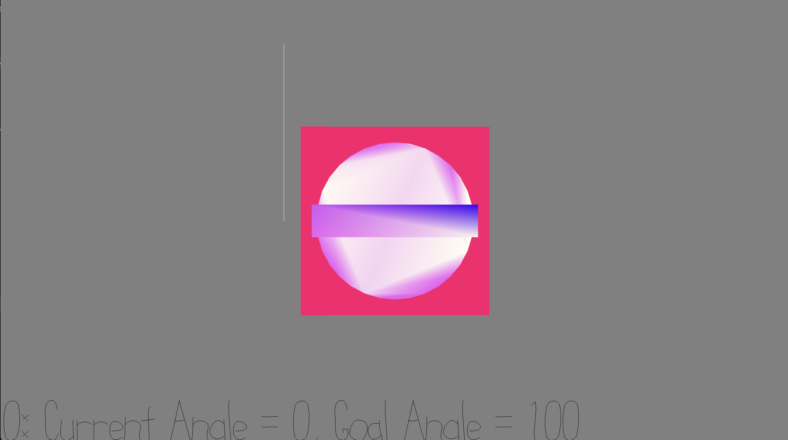

# Angle Matcher 2: Positive Reinforcement

Author: Ari Liloia

Design: This game is a continuation of the "angle matcher" game I submitted for game 2, but in this version there is background music, as well as a pleasant sound that plays when the angle is matched and an ugly one when it is not.

Screen Shot:

How To Play:
Turn the knob the match the angle at the bottom of the screen.

This game was built with [NEST](NEST.md).
